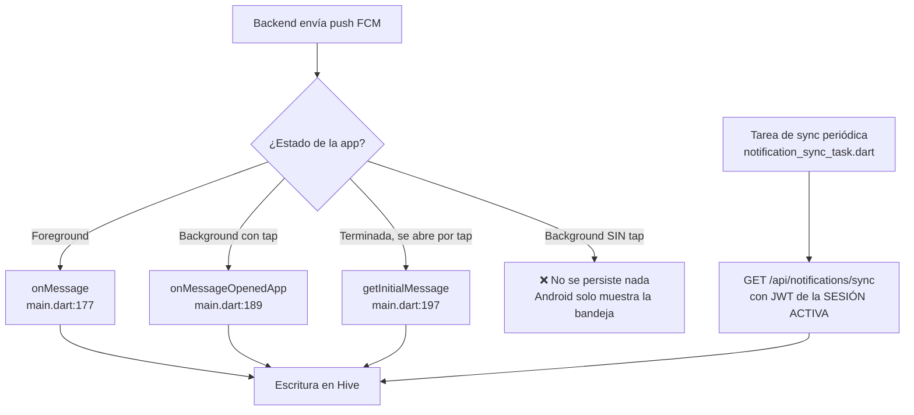
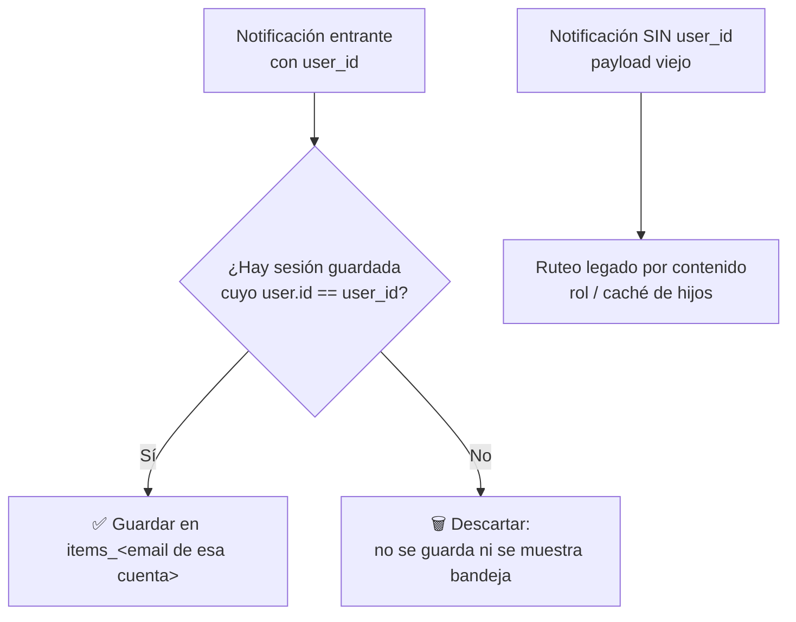

# Fix: notificaciones del maestro no llegan a su inbox (multi-sesión)

## 1. El síntoma

Un mismo dispositivo tiene **dos cuentas con sesión guardada**: la de padre y la de maestro (caso real: papás que también son maestros — reciben notificaciones de sus hijos **y** de su propia asistencia, muchas veces a la misma hora). El backend envía pushes de ambas cuentas al mismo FCM token del dispositivo. Lo que se observa:

- El inbox del **padre** registra todo: las asistencias de los hijos **y** las del maestro.
- El dashboard del **maestro** (`HomeMaestroScreen`, alimentado por `teacherProvider`) está **vacío**.

Scope acordado: **solo ruteo futuro**. Lo que ya quedó mal guardado se descarta (app en desarrollo, no hay migración).

## 2. Cómo funciona hoy el almacenamiento

Cada cuenta tiene su propio inbox en Hive, namespacedo por email:

```
notifications_box
├── items_papa@ijl.edu.mx      ← inbox del padre
├── items_maestra@ijl.edu.mx   ← inbox del maestro
└── items__anonymous           ← basurero: la UI nunca lo lee
```

La UI (`notificationProvider`) lee únicamente el inbox de la **cuenta activa** (`lib/features/notifications/providers/notification_provider.dart:14`). Si una notificación del maestro cae en el inbox del padre, el maestro jamás la verá.

## 3. Por qué falla hoy

El ruteo actual (sin commitear, `lib/core/utils/user_key.dart:49`) **adivina** el destinatario por contenido: rol de la sesión, caché de hijos, "si solo hay un papá...". Es frágil: cualquier payload inesperado o caché vacío lo desvía al inbox equivocado.

Además hay 4 puertas de entrada y una de ellas pierde datos por diseño:



El sync usa solo el JWT de la sesión activa, así que las pendientes de la otra cuenta nunca se descargan.

## 4. La solución: el backend manda el `user_id` del destinatario

En vez de adivinar, cada push lleva el id del usuario al que va dirigido. La app busca esa cuenta entre sus sesiones guardadas y guarda la notificación en **su** inbox — o la descarta si ese usuario no tiene sesión en el dispositivo.

### Prerequisito — cambio en el backend (lo aplica el dueño del backend)

1. En `FcmNotificationService` / `SendAttendancePushJob`: agregar `user_id` al `data` de cada envío, con el id del usuario destinatario **de ese envío** (el job manda a varios usuarios; el `user_id` se inyecta por destinatario en `sendToDevice`).
2. Incluir `user_id` también en cada item de `GET /api/notifications/sync`.

### Ruteo en la app (determinístico)



- `NotificationItem.fromFcm` / `fromSyncApi` parsean `user_id`.
- `resolveUserKeyForNotification` se simplifica: match exacto por `user.id` en `auth_box['sessions']`; sin match → `null` (descartar); sin `user_id` en el payload → ruteo legado por contenido (compatibilidad con mensajes viejos).
- El **ACK** al backend se hace con el JWT de la cuenta dueña de la notificación, no con el de la sesión activa.

## 5. Sync multi-cuenta (background)

Para que ambos inboxes se mantengan al día aunque nadie toque la bandeja, la tarea de sync itera **todas las sesiones guardadas**, cada una con su propio JWT:

```mermaid
flowchart TD
    A[Tarea de sync<br/>periódica / al abrir app] --> B[SessionStore.listSessions]
    B --> C[Cuenta padre] & D[Cuenta maestra]
    C --> E[JWT del padre<br/>jwt_token_papa@...]
    D --> F[JWT del maestro<br/>jwt_token_maestra@...]
    E --> G[GET /notifications/sync<br/>con JWT padre]
    F --> H[GET /notifications/sync<br/>con JWT maestro]
    G --> I[items_papa@... ✅]
    H --> J[items_maestra@... ✅]
    G & H --> K[ACK al backend<br/>con el JWT de cada cuenta]
```

Como el sync es por JWT, las notificaciones descargadas pertenecen a esa cuenta: se guardan directo en su inbox (con `user_id` como verificación extra si el backend lo incluye). Un error/401 en una cuenta se loggea y no detiene a las demás.

## 6. Cambios concretos en la app

- `lib/services/api_service.dart`: `ApiService({String? authToken})` — si se pasa, el interceptor lo usa en vez de leer el storage.
- `lib/features/notifications/models/notification_item.dart`: campo `recipientUserId` parseado de `user_id`.
- `lib/core/utils/user_key.dart`: ruteo por `user.id`; `null` = descartar; fallback legado por contenido.
- `lib/main.dart` + `lib/features/notifications/background/notification_sync_task.dart`: si el ruteo devuelve `null`, no persistir ni mostrar bandeja ni hacer ACK; ACK con el JWT de la cuenta dueña; loop de sync por sesión.
- Tests: ruteo por `user_id` (match, descarte, legado) y sync multi-cuenta (cada notificación cae en su inbox; un fallo en una cuenta no afecta a la otra).

## 7. Verificación final

- `flutter test` y `flutter analyze` en verde.
- En dispositivo, con ambas cuentas (papá-maestro):
  1. Push del hijo y push propio del maestro llegando casi a la misma hora → cada uno cae en su inbox.
  2. Push con app terminada **sin tocar la bandeja** → aparece tras el sync multi-cuenta.
  3. Push de un usuario sin sesión en el dispositivo → se descarta (no ensucia otros inboxes).
- Commit de los cambios.

## 8. Notas

- **El backend solo lo modifica su dueño** (AGENTS.md); la app queda lista para el `user_id` y mientras tanto usa el ruteo legado.
- `docs/issue_dobleLogin.md` describe un issue distinto (token FCM caducado, fix del lado backend); no es parte de este plan.
